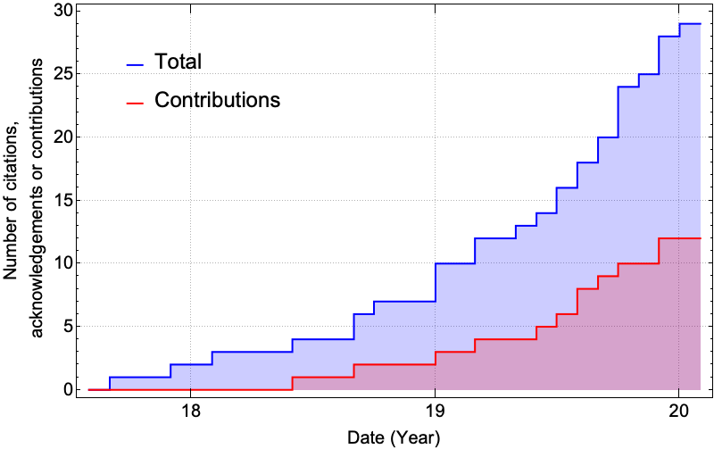

# Toolkit Contributors and Users

Building the Toolkit is a global, community effort and the fruits of that work are used even more widely. The below map shows the location of the developers, contributors and users of the Toolkit.

<iframe src="https://www.google.com/maps/d/u/0/embed?mid=1PZYkax3dpZ1Hx5b_MZ4qLl42AJIckGVt&z=2" width="840" height="580"></iframe>

The location of the lead institutions are shown in red, contributors are shown in blue and users in yellow. If you fall into any of these categories and are missing from the map let us know so we can add you.

## Papers that acknowledge, cite and/or extend the Toolkit

The graph below show the accumulated citations to the Toolkit over time. The blue curve shows the total citations and acknowledgements, the red curve tracks the total number of papers that have contributed software or data to the Toolkit.

Below is a list of research papers that have used or extended the Toolkit. Papers that have contributed code or data to the Toolkit have a (*) after them.

28\. "Dissipation in extreme-mass ratio binaries with a spinning secondary", Sarp Akcay, Sam R. Dolan, Chris Kavanagh, Jordan Moxon, Niels Warburton, Barry Wardell, [arXiv:1912.09461](https://arxiv.org/abs/1912.09461) (*)

27\. "The location of the last stable orbit in Kerr spacetime", Leo C. Stein, Niels Warburton, [arXiv:1912.07609](https://arxiv.org/abs/1912.07609) (*)

26\. "A Surrogate Model for Gravitational Wave Signals from Comparable- to Large- Mass-Ratio Black Hole Binaries", Nur E. M. Rifat, Scott E. Field, Gaurav Khanna, Vijay Varma, [arXiv:1910.10473](https://arxiv.org/abs/1910.10473) (*)

25\. "Spicing up the recipe for echoes from exotic compact objects: orbital differences and corrections in rotating backgrounds", Luís Felipe Longo Micchi, Cecilia Chirenti, [arXiv:1912.05419](https://arxiv.org/abs/1912.05419)

24\. "Gravitational wave signatures of ultralight vector bosons from black hole superradiance", Nils Siemonsen, William E. East, [Phys. Rev. D 101, 024019 (2020)](https://doi.org/10.1103/PhysRevD.101.024019),  [arXiv:1910.09476](https://arxiv.org/abs/1910.09476v2)

23\. "Tidal heating as a discriminator for horizons in extreme mass ratio inspirals", Sayak Datta, Richard Brito, Sukanta Bose, Paolo Pani, Scott A. Hughes, [arXiv:1910.07841](https://arxiv.org/abs/1910.07841)

22\. "Gravitational Wave Perturbations on a Kerr Background and Applications for Echoes", Randy S. Conklin, [arXiv:1911.07122](https://arxiv.org/abs/1911.07122)

21\. "Regularized calculation of the retarded Green function in Schwarzschild spacetime", Marc Casals, Brien C. Nolan, Adrian C. Ottewill, Barry Wardell, [Phys. Rev. D 100, 104037 (2019)](https://doi.org/10.1103/PhysRevD.100.104037),  [arXiv:1910.02567](https://arxiv.org/abs/1910.02567)

20\. "Transition from Inspiral to Plunge: A Complete Near-Extremal Waveform", Ollie Burke, Jonathan R. Gair, Joan Simón, [arXiv:1909.12846](https://arxiv.org/abs/1909.12846)

19\. "Eccentric-orbit EMRI radiation: Analytic forms of leading-logarithm and subleading-logarithm flux terms at high PN orders", Christopher Munna, Charles R. Evans, [arXiv:1909.05877](https://arxiv.org/abs/1909.05877) (*)  

18\. "Unveiling the Gravitational Universe at μ-Hz Frequencies", Alberto Sesana et al. [arXiv:1908.11391](https://arxiv.org/abs/1908.11391)

17\. "qnm: A Python package for calculating Kerr quasinormal modes, separation constants, and spherical-spheroidal mixing coefficients", Leo C. Stein, [J. Open Source Softw., 4(42), 1683 (2019)](https://doi.org/10.21105/joss.01683) [arXiv:1908.10377](https://arxiv.org/abs/1908.10377) (*)

16\. "Factorization and resummation: A new paradigm to improve gravitational wave amplitudes. III: the spinning test-body terms", Alessandro Nagar, Francesco Messina, Chris Kavanagh, Georgios Lukes-Gerakopoulos, Niels Warburton, Sebastiano Bernuzzi, Enno Harms, [Phys. Rev. D 100, 104056 (2019)](https://doi.org/10.1103/PhysRevD.100.104056), [arXiv:1907.12233](https://arxiv.org/abs/1907.12233) (*)

15\. "Quasi-circular inspirals and plunges from non-spinning effective-one-body Hamiltonians with gravitational self-force information", Andrea Antonelli, Maarten van de Meent, Alessandra Buonanno, Jan Steinhoff, Justin Vines, [arXiv:1907.11597](https://arxiv.org/abs/1907.11597)

14\. "Analytic solutions for parallel transport along generic bound geodesics in Kerr spacetime", M. van de Meent, [arXiv:1906.05090](https://arxiv.org/abs/1906.05090) (*)

13\. "Repeated faint quasinormal bursts in EMRI waveforms: evidence from frequency-domain scalar self-force calculations on generic Kerr orbits", Zach Nasipak, Thomas Osburn, Charles R. Evans, [Phys. Rev. D 100, 064008 (2019)](https://doi.org/10.1103/PhysRevD.100.064008), [arXiv:1905.13237](https://arxiv.org/abs/1905.13237) (*)

12\. "Hamilton-Jacobi equation for spinning particles near black holes", Vojtěch Witzany, [Phys. Rev. D 100, 104030 (2019)](https://doi.org10.1103/PhysRevD.100.104030), [arXiv:1903.03651](https://arxiv.org/abs/1903.03651)

11\. "Gravitational waves from bodies orbiting the Galactic Center black hole and their detectability by LISA", Eric Gourgoulhon, Alexandre Le Tiec, Frederic H. Vincent, Niels Warburton, [A&A, 627 (2019) A92](https://doi.org/10.1051/0004-6361/201935406), [arXiv:1903.02049](https://arxiv.org/abs/1903.02049) (*)

10\. "Exciting black hole modes via misaligned coalescences: I. Inspiral, transition, and plunge trajectories using a generalized Ori-Thorne procedure", Anuj Apte, Scott A. Hughes, [Phys. Rev. D 100, 084031 (2019)](https://doi.org/10.1103/PhysRevD.100.084031),  [arXiv:1901.05901](https://arxiv.org/abs/1901.05901)

9\. "Spin and Quadrupole Couplings for High Spin Equatorial Intermediate Mass-ratio Coalescences", Bin Chen, Geoffrey Compère, Yan Liu, Jiang Long, Xuao Zhang, [arXiv:1901.05370](https://arxiv.org/abs/1901.05370)

8\. "Spectroscopy of Extremal (and Near-Extremal) Kerr Black Holes", M. Casals, Luís F. Longo Micchi, [Phys. Rev. D 99, 084047 (2019)](https://doi.org/10.1103/PhysRevD.99.084047),  [arXiv:1901.04586](https://arxiv.org/abs/1901.04586)

7\. "High-order asymptotics for the Spin-Weighted Spheroidal Equation at large real frequency", M. Casals, A. C. Ottewill, N. Warburton, [Proc. R. Soc. A 475:20180701 (2019)](https://doi.org/10.1098/rspa.2018.0701), [arXiv:1810.00432](https://arxiv.org/abs/1810.00432) (*)

6\. ""Flux-balance formulae" for extreme mass-ratio inspirals", Soichiro Isoyama, Ryuichi Fujita, Hiroyuki Nakano, Norichika Sago, Takahiro Tanaka, [Prog. Theor. Exp. Phys. (2019) 013E01](https://doi.org/10.1093/ptep/pty136), [arXiv:1809.11118](https://arxiv.org/abs/1809.11118)

5\. "Gravitational self-force corrections to gyroscope precession along circular orbits in the Kerr spacetime", D. Bini, T. Damour, A. Geralico, C. Kavanagh, M. van de Meent, [Phys. Rev. D 98, 104062 (2018)](https://doi.org/10.1103/PhysRevD.98.104062), [arXiv:1809.02516](https://arxiv.org/abs/1809.02516) (*)

4\. "Black holes, gravitational waves and fundamental physics: a roadmap", Leor Barack et al., [Class. Quant. Grav. 36:14](https://doi.org/10.1088/1361-6382/ab0587) [arXiv:1806.05195](https://arxiv.org/abs/1806.05195)

3\. "Fast Self-Forced Inspirals", M. van de Meent, N. Warburton, [Class. Quant. Grav. 35:144003](https://doi.org/10.1088/1361-6382/aac8ce), [arXiv:1802.05281](https://arxiv.org/abs/1802.05281) (*)

2\. "Gravitational waves from plunges into Gargantua", Geoffrey Compère, Kwinten Fransen, Thomas Hertog, Jiang Long, [Class. Quant.Grav. 35 (2018) no.10, 104002](http://iopscience.iop.org/article/10.1088/1361-6382/aab99e/meta), [arXiv:1712.07130](https://arxiv.org/abs/1712.07130)

1\. "Quantum correlator outside a Schwarzschild black hole", Cláudia Buss, Marc Casals, [Phys. Lett. B 776, p168-173 (2017)](https://doi.org/10.1016/j.physletb.2017.11.048), [arXiv:1709.05990](https://arxiv.org/abs/1709.05990)

If you have a work that makes use of the Toolkit and would like it listed here please let us know.
